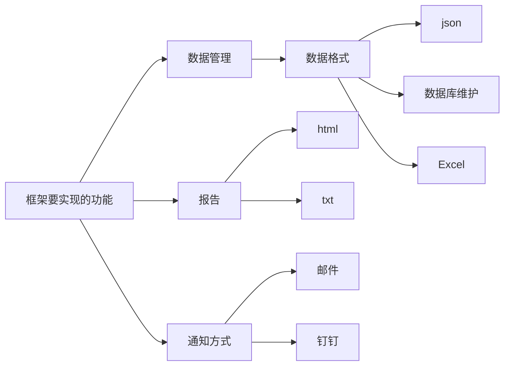

# InterfaceTest

## 接口测试框架

第一天进度：
configHttp公共类完成，主要负责请求接口
readExcel 公共类完成，主要负责读取测试数据

第二天进度：
requestAssert公共类完成，主要负责断言接口返回值与预期值是否一致
testInterface公共类完成部分，剩余将接口请求结果写入Excel中

第三天进度：
writeExcel公共类完成，主要负责将断言结果和接口请求状态码写入excel

第四天进度：
configemail公共类完成，主要负责配置邮件信息

第五天进度：
readconfig公共类完成，主要负责从config.ini文件中读取配置信息，并且返回读取的数据

---------------------------------------华丽的分割线----------------------------------------------------

# 接口自动化测试框架开发

## Part1 需求

### `接口调研`

- [ ] 主要调研要覆盖自动化的接口类型有哪些

  有些情况不能做接口自动化：

  1. 第三方接口

  2. 支付接口

  3. 运营商服务

- [ ] 划分优先级：哪些可以做接口自动化、哪些不可以做

- [ ] 最终框架要实现的功能

- [ ] 成果物：出具一份文档，和上级同事沟通，如果没问题则进行开发

## Part2 设计

### `思想`

